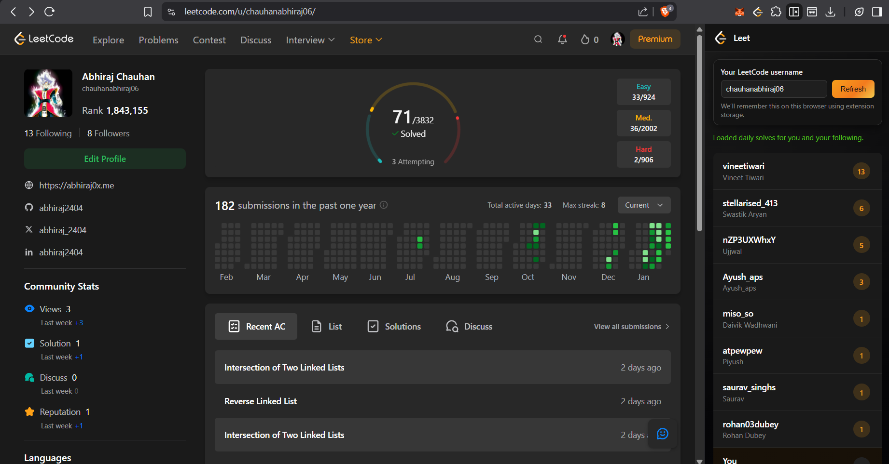

# Leet - LeetCode Following Tracker

A Chrome extension that shows how many LeetCode problems you and the people you follow have solved today.



## Features

- 📊 **Daily solve tracker** - See today's problem count for everyone you follow
- 🏆 **Leaderboard view** - Sorted by solve count to see who's grinding the hardest
- 👤 **Your stats included** - Your own progress highlighted at the top
- 🔗 **Quick profile access** - Click any username to visit their LeetCode profile
- 💾 **Remembers your username** - No need to re-enter every time
- 🎨 **Native LeetCode styling** - Dark theme that matches LeetCode's UI

## Installation

### Download from GitHub Releases (Recommended)

1. Go to the [Releases](https://github.com/abhiraj2404/Leet/releases) page
2. Download the latest `leet-extension-v1.0.zip` file
3. Extract the zip file to a folder
4. Open your browser and navigate to:
   - Chrome: `chrome://extensions`
   - Brave: `brave://extensions`
   - Edge: `edge://extensions`
5. Enable **Developer mode** (toggle in the top right corner)
6. Click **Load unpacked**
7. Select the extracted folder
8. Navigate to [leetcode.com](https://leetcode.com) and click the extension icon (or press `Ctrl+B`)

### Clone from Source

1. Clone this repository:
   ```bash
   git clone https://github.com/abhiraj2404/Leet
   ```
2. Follow steps 4-8 above

## Usage

1. Enter your LeetCode username
2. Click "Refresh" to load data
3. See your daily solve count alongside everyone you follow

## Tech Stack

- Chrome Extension (Manifest V3)
- LeetCode GraphQL API
- Vanilla JavaScript
